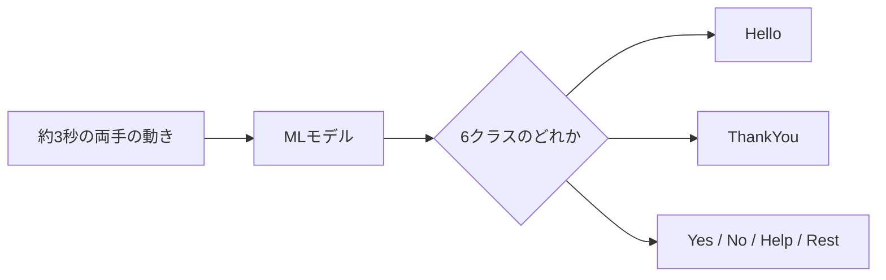
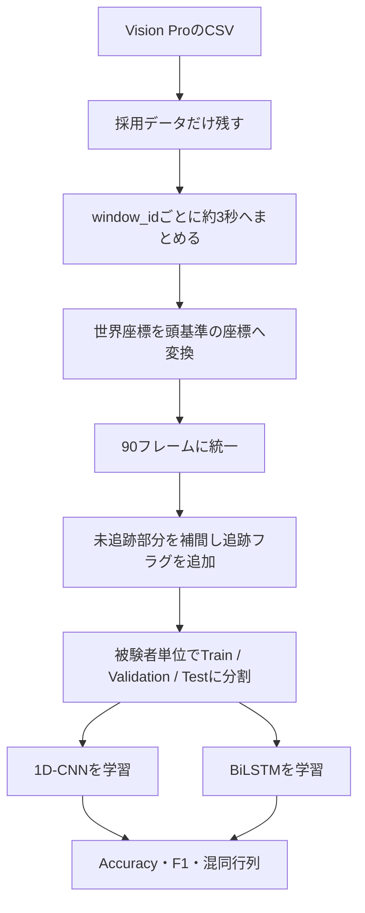
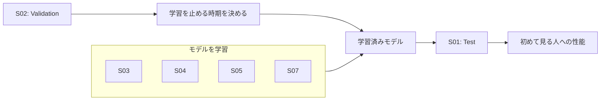
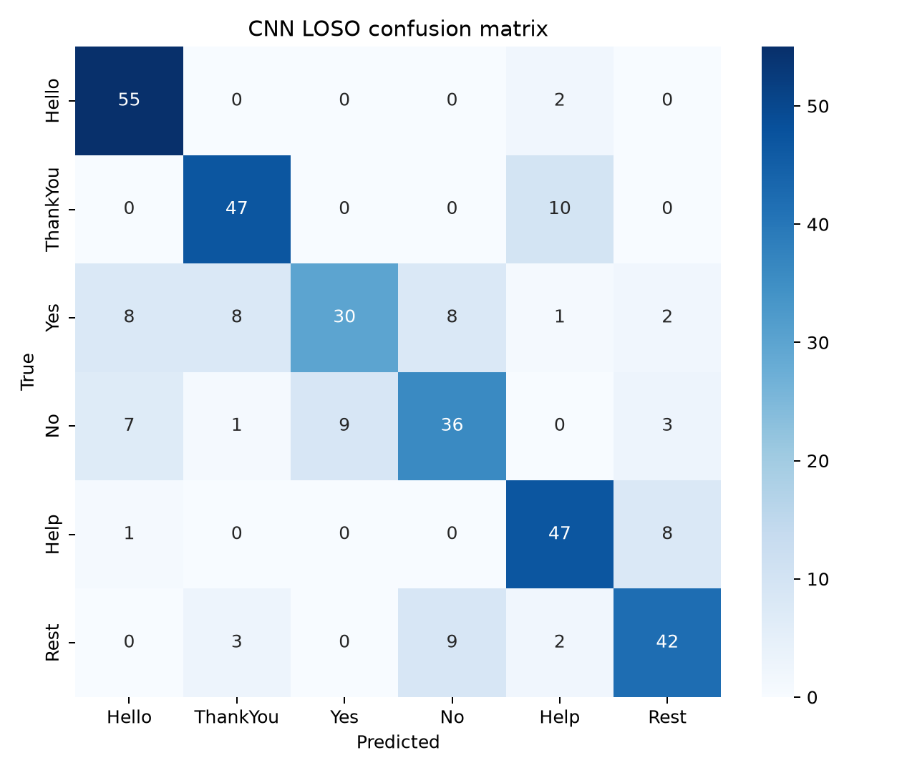
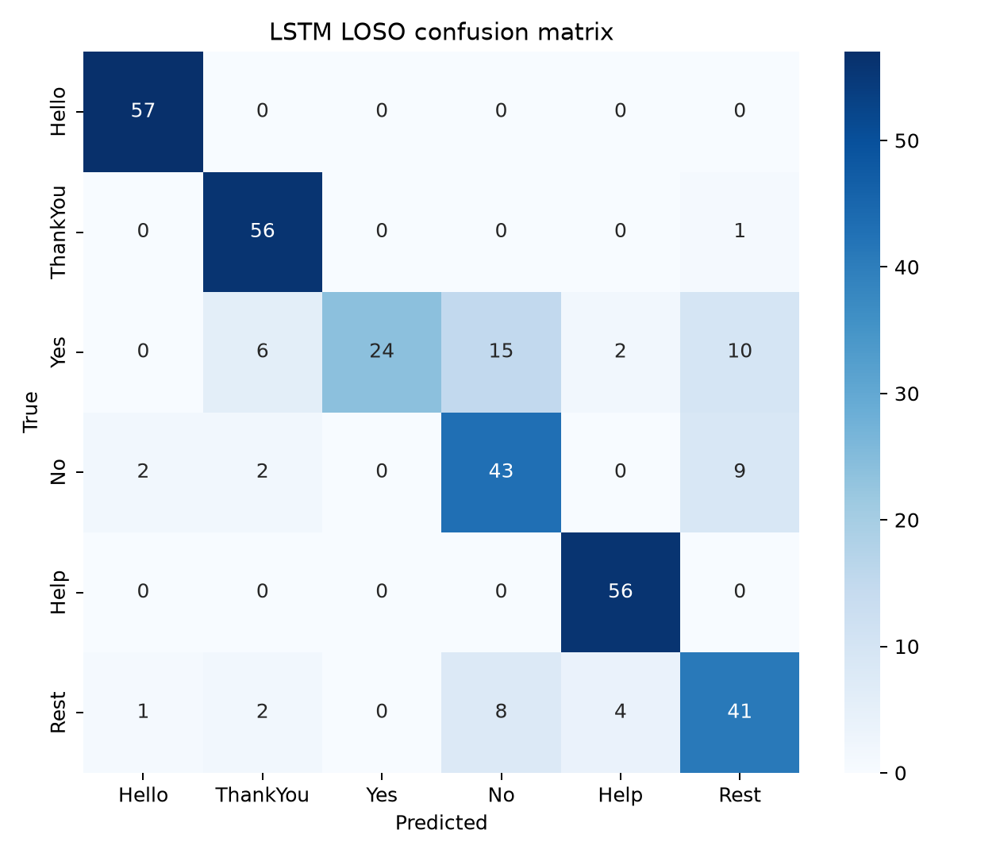

# Apple Vision Pro手話認識 — ML初心者向けガイド

この資料の目的は、今回のCNN/LSTM実験について、次の3点を自分の言葉で説明できるようになることです。

1. 何を入力し、何を予測したのか
2. どのように公平な評価をしたのか
3. なぜCNNとLSTM、LOSO、F1スコアなどを選んだのか

---

## 1. 今回の課題を一文で言うと

> Apple Vision Proで約3秒間記録した両手の動きから、`Hello`、`ThankYou`、`Yes`、`No`、`Help`、`Rest` の6クラスを判定する問題です。

これは「分類問題」です。分類問題とは、入力されたデータを、あらかじめ決められたカテゴリのどれかに割り当てる問題です。



---

## 2. CSVの1行と、学習データ1件は違う

CSVの1行は「ある瞬間の1フレーム」です。今回の記録は約30 fpsなので、3秒間で約90フレームになります。

モデルへ渡す学習データ1件は、1行ではなく、同じ `window_id` を持つ約90行を時系列順にまとめた「1ウィンドウ」です。

```text
1フレーム  = ある瞬間の手の位置
約90フレーム = 1回の手話動作
1ウィンドウ = 学習データ1件
```

今回使用したデータは次のとおりです。

| 項目 | 内容 |
|---|---:|
| 被験者 | S01、S02、S03、S04、S05、S07の6名 |
| 学習・評価対象 | 339ウィンドウ |
| クラス | 6種類 |
| 1ウィンドウ | 90フレーム |
| 1フレームの特徴 | 164個 |

164特徴の内訳は、両手の関節座標162個と、左右の手が追跡できているかを表す2個のフラグです。

```text
27関節 × 2手 × xyz 3軸 = 162座標
左手・右手の追跡フラグ = 2
合計 = 164特徴 / フレーム
```

したがって、モデルが受け取る1件のデータは、おおよそ「90行 × 164列の表」だと考えられます。

---

## 3. 生データから結果までの全体像



以降では、それぞれの処理が必要な理由を説明します。

---

## 4. 前処理で行ったことと、その理由

### 4.1 採用された本番データだけを使う

使用条件は次の2つです。

```text
is_warmup == 0
kept == 1
```

- ウォームアップは練習なので評価対象にしません。
- `kept == 0` は収録時にやり直しと判断されたデータなので除外します。

低品質と分かっているデータまで学習すると、モデルが正しい手話ではなく、失敗した動作まで覚えてしまう可能性があります。

### 4.2 頭を基準にした座標へ変換する

Vision Proが記録する生の座標は、部屋の中の世界座標です。同じ手話でも、立つ位置や顔の向きが変わると数値が変わります。

そこで、手の座標から頭の位置を引き、頭の向きに合わせて回転させました。

```text
変換前：「部屋のどこに手があるか」
変換後：「頭から見て、どこに手があるか」
```

手話では顔や身体に対する手の位置が重要です。そのため、部屋基準よりも頭基準の方が、被験者や立ち位置の違いを減らしやすいと考えました。

### 4.3 すべて90フレームにする

実際の記録は90フレームまたは91フレームなど、わずかに長さが違います。ニューラルネットワークへまとめて入力するには、同じ長さにそろえる方が扱いやすいため、最初の90フレームへ統一しました。

- 90より長い場合：後ろを切る
- 90より短い場合：最後の値で埋める

これは実装が単純で比較しやすい方法ですが、動作速度の違いを完全には扱えません。この点はLimitationsです。

### 4.4 手を追跡できなかったフレームを扱う

S07では、採用フレームのうち左手28.1%、右手14.0%が未追跡でした。未追跡座標をそのまま0にすると、「本当に座標0に手があった」とモデルが誤解する可能性があります。

そこで、次の2段階で扱いました。

1. 前後に追跡できたフレームがあれば、途中の位置を時間方向に補間する
2. 左右の手が追跡できていたかを、別の2特徴としてモデルへ渡す

つまり、推定した座標だけでなく「この値は本当に観測できたか」もモデルへ伝えています。

### 4.5 訓練データだけで標準化する

座標ごとに値の大きさが違うため、平均0、標準偏差1に近づける標準化を行いました。

重要なのは、平均と標準偏差を訓練被験者だけから計算した点です。テスト被験者の統計量まで使うと、答えを見る前にテストデータの情報を利用したことになり、「データリーク」が起きます。

---

## 5. なぜランダム分割ではなくLOSOなのか

### ランダム分割の問題

339ウィンドウを無作為に80%と20%へ分けると、同じ被験者の動作が訓練とテストの両方へ入ります。

モデルが「手話の一般的な特徴」ではなく、「その人特有の手の大きさや動かし方」を覚えた場合でも、高い精度が出る可能性があります。

### LOSOの考え方

LOSOは `Leave-One-Subject-Out` の略で、1人を完全にテスト専用として残します。

今回の1つ目のfoldは、次のようになります。



その後、テスト担当をS02、S03……と交代し、全員が1回ずつテストになるよう6回繰り返します。

| Fold | Test | Validation | Train |
|---:|---|---|---|
| 1 | S01 | S02 | S03, S04, S05, S07 |
| 2 | S02 | S03 | S01, S04, S05, S07 |
| 3 | S03 | S04 | S01, S02, S05, S07 |
| 4 | S04 | S05 | S01, S02, S03, S07 |
| 5 | S05 | S07 | S01, S02, S03, S04 |
| 6 | S07 | S01 | S02, S03, S04, S05 |

この分割を選んだ理由は、最終的に実現したいことが「収録済みの同じ人を当てること」ではなく、「まだ学習に使っていない人の手話を認識すること」だからです。

---

## 6. Train、Validation、Testの役割

| データ | 役割 | たとえ |
|---|---|---|
| Train | モデルのパラメータを学習する | 教科書と練習問題 |
| Validation | 学習をいつ止めるか判断する | 模擬試験 |
| Test | 最後に性能を測る | 本番試験 |

Testを見ながらモデルを調整すると、本番試験の答えを見ながら勉強することになります。そのため、Testは最後の評価だけに使用しました。

---

## 7. CNNとは何か、なぜ選んだのか

CNNは `Convolutional Neural Network` の略です。画像に使われることが多いモデルですが、時間方向へ畳み込みを行う1D-CNNは時系列にも利用できます。

今回のCNNは、短い時間範囲を順番に見ながら、特徴的な動きのパターンを探します。

```text
フレーム 1  2  3  4  5  6  7 ...
             └─短い範囲─┘
                 ↓
        局所的な動きの特徴を検出
```

CNNを選んだ理由：

- 既存コードにCNNのベースラインがあり、約77%の結果と比較できる
- LSTMより並列計算しやすく、一般に学習が速い
- 短時間の手の形や動きのパターンを検出しやすい
- 時系列分類の基準モデルとして分かりやすい

---

## 8. LSTMとは何か、なぜ選んだのか

LSTMは `Long Short-Term Memory` の略で、時系列の順番を扱うためのニューラルネットワークです。

手話では「手がどこにあるか」だけでなく、「どの方向からどの方向へ動いたか」が重要です。LSTMは、前の時刻までの情報を内部状態として持ちながら次のフレームを読みます。

今回は双方向LSTM（BiLSTM）を使いました。

```text
過去から未来へ  → → →
フレーム          1 2 3 ... 90
未来から過去へ  ← ← ←
```

BiLSTMを選んだ理由：

- 手話の時間的な順番と長めの動きを学習しやすい
- 収録済みの3秒全体を見て分類するオフライン課題に適している
- CNNとは異なる時系列の捉え方を比較できる
- チャット上でAoiさんの担当モデルとして指定されていた

注意点として、未来側のフレームも使うBiLSTMは、動作の途中で即座に答える完全リアルタイム用途にはそのまま使えません。今回は3秒の記録終了後に分類する評価なので採用しました。

---

## 9. 学習中に行った工夫

### クラス重み付き損失

S07の件数が少ないため、各クラスは56件または57件でした。大きな偏りではありませんが、少数クラスを無視しにくくするため、訓練fold内の件数からクラス重みを計算しました。

### Early Stopping

学習を続けすぎると、訓練データだけに適応する過学習が起きます。ValidationのMacro F1が改善しない状態が12 epoch続いたら学習を停止しました。

### 3つの乱数seed

ニューラルネットワークは、最初の重みやデータを読む順番に乱数を使います。同じ条件でも1回ごとに結果が少し変わるため、seed 0、1、2の3回を実行し、平均とばらつきを報告しました。

---

## 10. 評価指標の読み方

### Accuracy

全予測のうち、正解した割合です。

```text
Accuracy = 正解数 ÷ 全データ数
```

直感的ですが、あるクラスだけ多いデータでは、多数派だけを当てても高くなることがあります。

### Precision

モデルがあるクラスだと予測したもののうち、本当にそのクラスだった割合です。

> 「Yesと予測したとき、どの程度信用できるか」

### Recall

本当はそのクラスだったデータのうち、モデルが見つけられた割合です。

> 「本当のYesを、どの程度見逃さなかったか」

### F1スコア

PrecisionとRecallの両方をまとめた指標です。0から1の範囲で、1に近いほど良い結果です。

### Macro F1

6クラスそれぞれのF1を計算して、単純平均した値です。件数が少ないクラスも同じ1クラスとして評価するため、全クラスをバランスよく認識できているか確認できます。

---

## 11. 混同行列の読み方

- 行：本当のクラス
- 列：モデルが予測したクラス
- 左上から右下の対角線：正解
- 対角線以外：誤分類

### CNN



### LSTM



例えばLSTMの代表実行では、本当は `Yes` だった57件のうち、24件を正しく `Yes` と認識しました。一方、15件を `No`、10件を `Rest` と誤認しています。このことから、Yesの動きを区別するためのデータや特徴が不足している可能性が分かります。

---

## 12. 結果をどう解釈するか

### 全体結果

| Model | Accuracy | Macro F1 |
|---|---:|---:|
| CNN | 77.2 ± 2.4% | 76.6 ± 2.4% |
| LSTM | **80.9 ± 2.7%** | **80.1 ± 2.7%** |

LSTMはCNNよりAccuracyが約3.7ポイント高くなりました。今回のデータでは、局所的なパターンを見るCNNより、時間の順番を扱うLSTMの方が少し適していたと解釈できます。

ただし、「LSTMが常にCNNより優れている」とは言えません。被験者は6名だけであり、データや設定が変われば結果も変わるためです。

### クラス別結果

| Class | CNN F1 | LSTM F1 |
|---|---:|---:|
| Hello | 87.5 ± 2.8% | **96.5 ± 0.7%** |
| ThankYou | 85.3 ± 4.5% | **87.9 ± 6.2%** |
| Yes | 59.9 ± 3.2% | **63.5 ± 6.0%** |
| No | 66.0 ± 2.2% | **72.7 ± 2.0%** |
| Help | 85.2 ± 4.0% | **93.1 ± 4.4%** |
| Rest | **75.7 ± 6.5%** | 67.0 ± 2.1% |

- `Hello` と `Help` はLSTMで非常に高いF1でした。
- `Yes`、`No`、`Rest` は互いに混同されやすいクラスでした。
- `Rest` だけはCNNの方が高く、モデルごとに得意な動きが異なることが分かります。

### S07を含めた意味

S07は他の被験者より未追跡フレームが多く、39ウィンドウしかありません。それでも除外せずLOSOへ入れることで、追跡状態が悪い新しい人に対してどの程度動くかを確認できました。

S07をテストにしたときの3回平均Accuracyは次のとおりです。

| Model | S07 Accuracy |
|---|---:|
| CNN | 59.8% |
| LSTM | **74.4%** |

これは、追跡マスクと時間的な情報を利用したLSTMが、今回のS07に対して比較的頑健だった可能性を示します。ただし、S07一人だけの結果なので一般化はできません。

---

## 13. なぜこのアプローチを選んだか — 要約

| 選択 | 選んだ理由 |
|---|---|
| 6クラス分類 | プロジェクトのラベルが6種類だから |
| 頭基準座標 | 部屋の位置や顔の向きの影響を減らすため |
| 90フレーム | 3秒記録を同じ形でモデルへ入力するため |
| 補間＋追跡マスク | 未追跡を本物の座標0と誤解させないため |
| LOSO | 初めて見る被験者への性能を測るため |
| 別のValidation被験者 | Testを見ずにEarly Stoppingするため |
| CNN | 高速で分かりやすい時系列ベースラインだから |
| BiLSTM | 手話の時間的な順番を捉えやすいから |
| クラス重み | クラス件数の小さな差を補うため |
| Macro F1 | 全クラスを同じ重みで評価するため |
| 3 seed | 1回だけの偶然による結果を避けるため |

---

## 14. そのまま使える説明例

### 30秒版

> Vision Proから取得した両手54関節の3次元座標を、頭を基準とする座標へ変換し、約3秒・90フレームの時系列としてCNNとLSTMへ入力しました。評価では、同じ人のデータが訓練とテストに入ると精度が過大評価されるため、1人ずつ完全にテストへ残すLOSOを使いました。6名339件を3つのseedで評価した結果、CNNはAccuracy 77.2%、LSTMは80.9%で、今回のデータでは時間的な順番を扱うLSTMが少し良い結果でした。

### 2分版

> 今回は、Vision Proで記録した約3秒間の手の動きから6種類の手話を分類しました。1フレームには左右54関節のxyz座標があり、これを頭基準へ変換して、立ち位置や顔の向きの影響を減らしました。各記録は90フレームへ統一しています。S07では手を追跡できないフレームが多かったため、前後の値から補間し、同時に追跡できていたかを示すマスクもモデルへ渡しました。
>
> 評価には被験者単位のLOSOを使いました。これは、1人を完全にテストへ残し、残りの人だけで学習する方法です。ランダム分割では同じ人が訓練とテストに入り、その人の癖を覚えただけでも高精度になる可能性があるためです。また、別の1人をValidationとしてEarly Stoppingに使い、テストデータを見ながら調整しないようにしました。
>
> モデルは、短い動きの特徴を見つける1D-CNNと、時間の順番を記憶する双方向LSTMを比較しました。3つの乱数seedでの平均AccuracyはCNNが77.2%、LSTMが80.9%でした。LSTMの方が全体では良好でしたが、Yes、No、Restの混同が残っており、被験者も6名だけなので、より多くのデータと実環境での検証が必要です。

---

## 15. よく聞かれそうな質問と回答

### Q1. なぜ通常のランダムなTrain/Test分割を使わなかったのですか？

同じ被験者の動きがTrainとTestの両方へ入ると、モデルがその人の癖を覚えて高い精度を出す可能性があるからです。今回は初めて見る人への性能を測りたいため、被験者単位のLOSOを使いました。

### Q2. なぜ頭を基準にしましたか？

手話では身体や顔に対する手の位置が重要だからです。世界座標のままだと、部屋のどこに立ったかという不要な違いが入ります。

### Q3. なぜCNNとLSTMを比較したのですか？

CNNは短い局所的な動きの特徴、LSTMは時間的な順番や長めの依存関係を扱うのが得意です。異なる考え方の時系列モデルを同じ条件で比較するためです。また、Aoiさんの担当モデルとして指定されていました。

### Q4. なぜAccuracyだけでは不十分ですか？

Accuracyは全体の正解率しか示しません。クラス別F1と混同行列を見ることで、どの手話が認識でき、どの手話を混同しているかが分かります。

### Q5. 80.9%なら実用化できますか？

まだ言えません。6名、6クラス、各1セッションのオフライン評価だからです。別の日、別の環境、より多くの被験者、リアルタイム動作で確認する必要があります。

### Q6. S07は追跡欠損が多いのに、なぜ使ったのですか？

現実には常に完全な追跡が得られるとは限らず、新しい被験者への頑健性を確認できるからです。ただし、結果へ大きな影響を与えるため、欠損率をLimitationsとして明記しました。

### Q7. なぜ3回実行したのですか？

ニューラルネットワークの結果は初期値や学習順の乱数で変わるからです。1回の最良値ではなく、平均とばらつきを示す方が誠実な報告になります。

### Q8. LSTMが良かった理由は何ですか？

今回の手話では、瞬間的な手の形だけでなく、動く順番や軌跡が重要だった可能性があります。ただし、データ数が少ないため、理由が確定したとは言えません。

---

## 16. 言ってよいこと・まだ言えないこと

### 結果から言ってよいこと

- 今回の6名・339件では、LSTMの平均AccuracyがCNNより約3.7ポイント高かった。
- LOSOを使い、テスト被験者を訓練から分離した。
- `Hello` と `Help` は比較的認識しやすく、`Yes`、`No`、`Rest` は混同されやすかった。
- S07を含めても学習と評価を実行できた。

### まだ言えないこと

- すべての人に80.9%で使える。
- 実際のリアルタイム環境でも同じ精度が出る。
- LSTMが常にCNNより優れている。
- 6種類以外の手話も認識できる。
- 追跡欠損の影響を完全に解決できた。

---

## 17. 用語集

| 用語 | 短い意味 |
|---|---|
| Feature | モデルへ渡す数値。今回は関節座標や追跡フラグ |
| Label / Class | 正解カテゴリ。今回は6種類の手話 |
| Window | 約3秒分をまとめた学習データ1件 |
| Model | 入力からクラスを予測する仕組み |
| Training | モデルの重みを学習すること |
| Validation | 学習設定や停止時期を決めるためのデータ |
| Test | 最終性能を測るための未使用データ |
| Epoch | 訓練データ全体を1回学習する単位 |
| Loss | 予測が正解からどの程度ずれているかを示す値 |
| Overfitting | 訓練データだけを覚え、未知データに弱くなること |
| Data leakage | Testの情報が学習や調整に混入すること |
| LOSO | 1人を完全にテストへ残す被験者単位評価 |
| Accuracy | 全体の正解率 |
| F1 | PrecisionとRecallのバランス |
| Macro F1 | クラス別F1を同じ重みで平均した値 |
| Confusion matrix | 正解クラスと予測クラスの組み合わせ表 |
| Seed | 乱数を再現するための番号 |

---

## 18. 自分で確認する3問

1. なぜ1フレームではなく約90フレームを1件として扱うのでしょうか？
2. 同じ被験者をTrainとTestへ入れると、なぜ評価が高く見える可能性があるのでしょうか？
3. Accuracyが高くても、混同行列とクラス別F1を見る必要があるのはなぜでしょうか？

答えを自分の言葉で説明できれば、今回の実験の中心部分を理解できています。

---

## 関連ファイル

- `ml/aoi_lstm_cnn.py`：前処理、CNN/LSTM、LOSO評価の実装
- `AOI_ML_REPORT.md`：提出用の簡潔な結果レポート
- `results/aoi_ml/fold_metrics.csv`：被験者・seedごとの評価
- `results/aoi_ml/per_class_f1.csv`：クラス別F1
- `results/aoi_ml/summary.json`：実験条件と結果の要約
